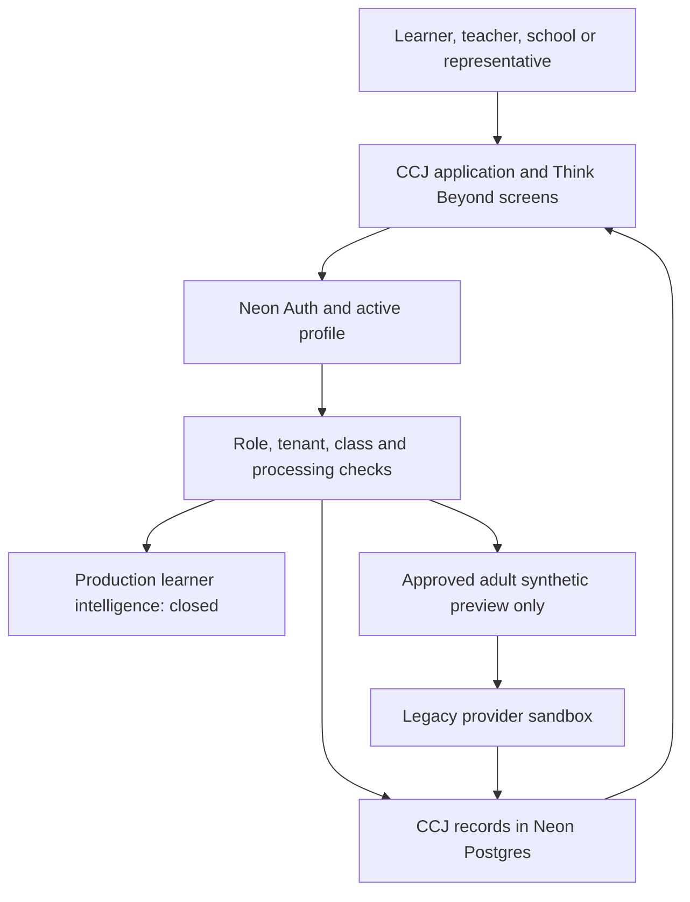
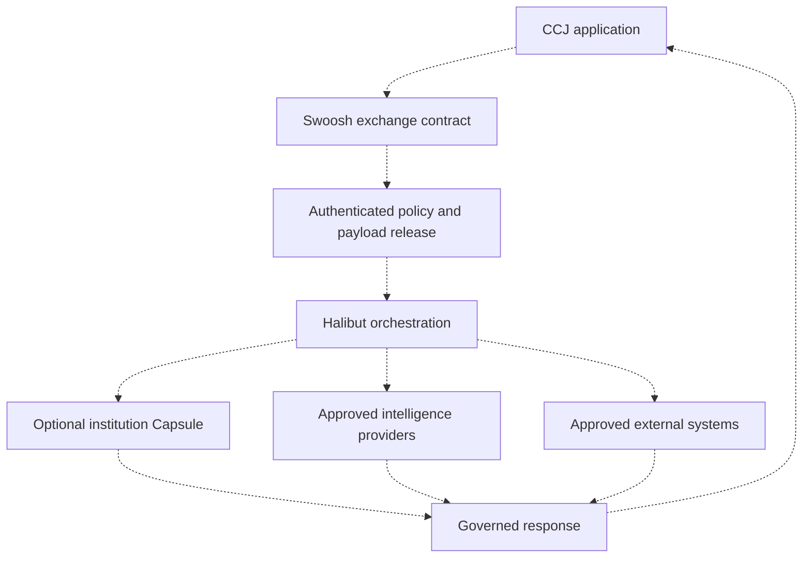
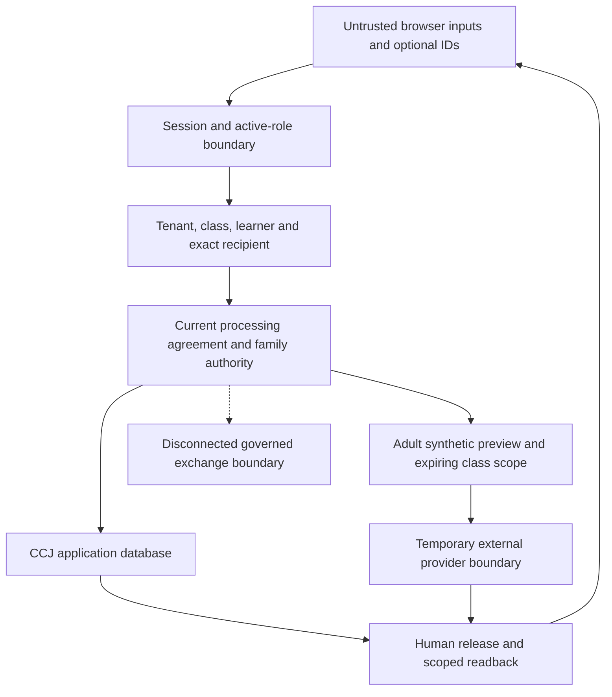

# Career Compass Junior: recovered implementation and enforced boundaries

Status: tested draft implementation, not a production acceptance certificate. Read with [the Phase A closeout checklist](../production/PHASE_A_CLOSEOUT_20261002.md). The recovered baseline is published Professor Vi commit `6d8f114`, plus the recovered Phase A boundary changes. Existing curriculum, portals, assignments, evidence records, integration adapters and administrative LangGraph workflows are preserved.

## Actual runtime

Ordinary book practice, durable attempts, submissions, teacher feedback, assessments and evidence use CCJ application services and CCJ records. They do not traverse hypothetical intelligence infrastructure. The learner AI sandbox still calls an existing provider adapter directly; it is deliberately excluded from production. `CCJ_INTELLIGENCE_RUNTIME_MODE=governed_halibut` returns unavailable because no connected Swoosh/Halibut transport exists. A mode name, deployment request or policy row is not a working connection.

The admin connectivity diagnostic is a separate existing pathway: authenticated platform admin → bounded static diagnostic prompt → provider → diagnostic audit metadata. It carries no learner content, and a mock result is not proof of provider connectivity. Existing administrative LangGraph builds are not a connected Halibut OS intelligence runtime.

## Intended connected path: still a delivery gap

Dashed connections are targets, not implemented transports. Native Swoosh claims, a Capsule foundation repository and CCJ `learning_capsules` evidence tables must not be presented as interchangeable capabilities. No school-local CCJ knowledge custody, Swoosh payload signing, Halibut model routing or provider-independent live learner runtime has been accepted in this recovery.

## Component and responsibility matrix

| Component | Responsibility | Implemented evidence | Remaining boundary |
|---|---|---|---|
| CCJ | Learner/teacher/school application; Explain → Create → Improve | Existing activity contracts, attempts, revision workflow, assessments, feedback and evidence; restored Professor Vi/report studio source | Authenticated acceptance on controlled accounts remains required |
| Think Beyond | Learner-facing Professor Vi environment | Existing study screen retained and named; school/privacy readiness enforced by server access checks | Production remote intelligence disabled |
| Professor Vi / Intelligence Instructor | Instructional protocol; bounded scaffolds; human-reviewed study packs | `lib/professor-vi/protocol.ts`, `access.ts`, `context.ts`, `runtime.ts`; pending pack content removed from generation response | Protocol behavior is not proof of a model's safety; real provider and classroom validation outstanding |
| Swoosh | Governed data/event exchange | No CCJ transport adapter connected; runtime mode denies unsupported connection | Signed/authenticated, schema-controlled, auditable tenant-bound exchange must be implemented and contract-tested |
| Halibut OS | Intelligence/agent/workflow coordination and model abstraction | No remote orchestrator connected | Institutional context, approved model access and response verification outstanding |
| Intelligence Capsule | Optional institution-controlled custody and release boundary | Deployment request and classification policy; unsupported private modes cannot receive approval | Custody, encryption, key rotation, local execution and accepted release transport outstanding |
| Neon Auth / CCJ profiles | Identity, session and application role | Production/preview reuse rejection; current admin recovery path retained; new promotion verified; optional tightening enforced at shared profile read | Verify both controlled administrators before enabling tightening |
| Privacy governance | School disclosure/review, representative authority, separate choices and rights review | Additive migration 016; transaction/audit records; current version, exact representative, active memberships and approval predicates | Signed documents, legal review, verified authority and actual storage/provider inventory are human acceptance requirements |
| External adapters / LTI | Defined institutional integration contracts | Existing adapter diagnostics retained; execution flags default off | LTI source is on a separate development branch and is not materialized in this recovered Professor Vi stack; no LMS/SIS end-to-end acceptance claimed |

## Data-flow and systems-of-record matrix

| Path | Data captured or used | System of record | Release/control |
|---|---|---|---|
| Sign-in/recovery | Email, credential/recovery/verification/session state; profile subject, role, locale/status, optional display name | Neon Auth; CCJ `profiles` | Signed-in identity; no automatic optional consent; signup/provisioning rollout gates; existing admin recovery preserved |
| Core learning | Activity/version, bounded responses, enrollment, attempt/submission IDs and progress | `activity_attempts`, `book_progress`, enrollments | Existing active learner/enrollment/class/tenant authorization; server acknowledgment required |
| Assignment and revision | Submission, immutable revisions and teacher feedback | `submissions`, `submission_revisions`, `teacher_feedback` | Existing assigned class and student-visible feedback rules |
| Assessment/evidence | Questions, attempts, rubric/evaluation/review state and evidence metadata | Assessment tables; `learning_capsules` | Review/mastery semantics; completion is not proof of demonstration; evidence records are not infrastructure Capsule custody |
| Report-card builder | Blank template requirements, country starting structure, draft schema | Builder sessions and report templates | Partner/admin tenant authorization; no-personal-data attestation; human activation; uploaded conversion unavailable without approved runtime |
| Optional consent | Tenant/learner/authority/purpose/version; distinct learner and representative timestamps; withdrawal | `optional_processing_consents`, authority and consent-event tables | Both current decisions, active verified representative, current independent school approval; no staff signing substitute |
| Guardian report | Named linked learner; reviewed shareable demonstrated/verified evidence; visible feedback and next work | CCJ education records; `guardian_report_links` | Exact representative and exact tenant/learner; rollout switch; current family choices; no private tutor transcript |
| Community | Team/project/submission/recognition; reviewed showcase | Existing community tables | Current participant choices; teacher/school permissions; all past/current contributors and submission authors checked before peer sharing/publication |
| Adult preview source | Source bytes temporarily at provider; original title/name/type/size/hash, provider reference and expiry at CCJ | `ai_study_sources`; provider temporary file | Explicit recognized non-production mode, feature/tenant policy, school approval, current choices, independently attested adult/class pilot, source permission; generic provider filename, 3 MiB cap, 1–30 day expiry |
| Adult preview tutoring/packs | Minimal age band/level/language/task; bounded learner message/source; generated packs/quizzes and recorded turns | Tutor messages/sessions; packs/generated activities/attempts | Production egress closed; scoped source/session; teacher review before pack release; conversation is not official evidence |
| Source removal | Owned tenant/source reference; removal outcome; metadata deletion marker | CCJ source metadata and provider deletion result | Does not require AI feature or current consent; ownership checked; provider 404 treated as already removed; credential/outage failure remains a review task |
| Rights/export | Scoped educational records; request type/status/execution reference | Export response; privacy rights requests and governance events | Session-bound learner export; own learner or verified representative requests; no immediate account erasure; terminal status requires evidence reference |
| Public business search | Public company name/site, verified business contact result | Existing institutional Industry Network records | Legacy provider search disabled in production; no learner transcript/identity in that workflow |
| Future Swoosh/Halibut/Capsule exchange | Only allowlisted, classified activity-specific context and governed response | Contract must designate authoritative records | No currently connected route; no uncontrolled direct integration DB access or child-linkable operational telemetry authorized |

## Trust boundaries

The server checks roles and scope rather than trusting submitted learner/org IDs or staff checkboxes. School agreement approval and its audit event are one SQL statement; consent updates and events are transactional. The family pair is invalidated on withdrawal, policy/authority change or school resubmission. Optional reads fail closed if governance or migration dependencies are missing. Browser mutations for sources/AI/report imports reject foreign origins and bound actual streamed bytes. These application controls do not claim database RLS, automated identity-document verification, DLP, hardware attestation or connected infrastructure authorization.

## Capsule classification and deployment modes

| Classification | CCJ storage | Institution-controlled custody | Temporary intelligence processing / release |
|---|---|---|---|
| Public curriculum | Published books/contracts/resources | Optional copies | Public content only through an accepted contract |
| Institutional configuration | Approved organization/class/configuration, processing disclosure, minimal contact/reference metadata | Signed agreements and protected authority documents | No automatic operational/AI release of personal contact information |
| Identifiable education records | Explicitly permitted learner progress, attempts, submissions, feedback, reports and reviewed evidence | Institution may require stricter/local custody; that deployment remains unconnected | Production learner AI disabled; future releases need subject/purpose/version/field/age/role/retention checks |
| Confidential knowledge / sensitive child data | Must not be uploaded to ordinary cloud fields | Protected records remain within the institution-approved boundary | Must never be released through the currently unsupported exchange; no claim of automatic content detection |
| Credentials, identity/medical/custody/financial documents, biometric/raw recordings | Auth credentials belong to Auth; these documents must not enter learning/AI/log fields; existing microphone replay is browser-local | Institution's approved protected systems | No model or operational-demo release authorized; privacy notice alone is not a DLP implementation |
| Operational telemetry | Minimal necessary service/audit metadata under approved retention | Deployment-specific protected operational records | No raw child content, child-linkable IDs, scores, digests or commitments merely because systems connect |

| Deployment mode | Current configuration behavior | Data location claim | Production readiness |
|---|---|---|---|
| ViTech managed cloud | Supported application mode; school submission/review required | Must disclose actual Auth/DB/hosting/provider/backups countries and processors | Existing application supported; recovered release awaits Phase A; no Vietnam-only claim |
| Hybrid institution | Request can be recorded; approval blocked | No record movement or local-only custody established | Not connected / no-go |
| Intelligence Capsule/private | Request can be recorded; approval blocked | Institution-control benefit is an intended accepted-deployment benefit | Not connected / no-go |
| Institution hosted/local, future | Request can be recorded; approval blocked | No supported local application/intelligence runtime established | Future / no-go |

Changing an `organization_data_policies` setting does not relocate existing cloud records. BYOK metadata is not an encrypted, rotated, connected secret runtime. The normal application does not become dependent on a model provider; the retained preview adapter remains provider-specific until Halibut can supply the abstraction.

## Degraded behavior and remaining acceptance

| Failure / restriction | Behavior actually provided | Practical limit |
|---|---|---|
| Swoosh/Halibut/Capsule disconnected | Runtime denied; optional exchanges cannot be activated; unsupported deployment approval rejected | No functioning exchange/failover claim |
| Production direct learner AI requested | Denied even with a provider key/live flag | Runtime guard must be deployed; current production artifact/config still unverified |
| AI provider unavailable in approved preview | Bounded timeout/error; no fabricated study generation or uploaded-template conversion | Browser retry/UX and paid-provider acceptance require controlled testing |
| Report AI unavailable | Built-in/blank deterministic draft still works | Upload conversion returns unavailable; country preset is not legal compliance or an official grade |
| Source metadata save failure / duplicate race | Cleanup attempted; duplicate returns an owned persisted winner; expired rows release unique slot | Provider cleanup can fail and needs reconciliation; source retention is distinct from account/record deletion |
| Consent revoked / stale / missing | Guardian/community/AI optional paths denied; withdrawal and rights requests remain accessible | In-flight external work, legal holds, account/provider/backups erasure need operations procedure |
| Database unavailable | Public curriculum/practice remains independent; durable writes cannot be certified without acknowledgment | Complete outage/browser acceptance and recovery time/data loss have not been measured |
| Device offline / cache eviction | Existing public-asset PWA safety retained; risky outbox flag default off | Real iOS eviction/reconnect/idempotency testing still required; local cache is not a backup |

Remaining gaps: real two-admin verification/login; fresh production-data rehearsal of 014–016 and old/new-code compatibility; correct Vercel project/secrets inventory; authenticated multi-role/multi-tenant browser journeys; actual iOS device tests; measured restore/reconciliation; named independent reviewer; signed Vietnamese school/processor documents and real contact/retention/location inventory; institution-bound age-aware signup before enabling public onboarding; production egress transport and provider abstraction; LTI branch reconciliation/contract acceptance; BYOK custody/rotation tests; complete multi-processor rights execution. Keep new onboarding and risky features off until their separate acceptance gates close.
