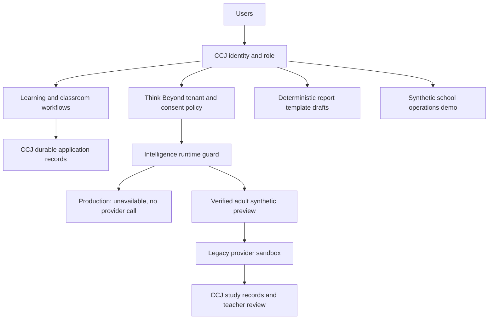
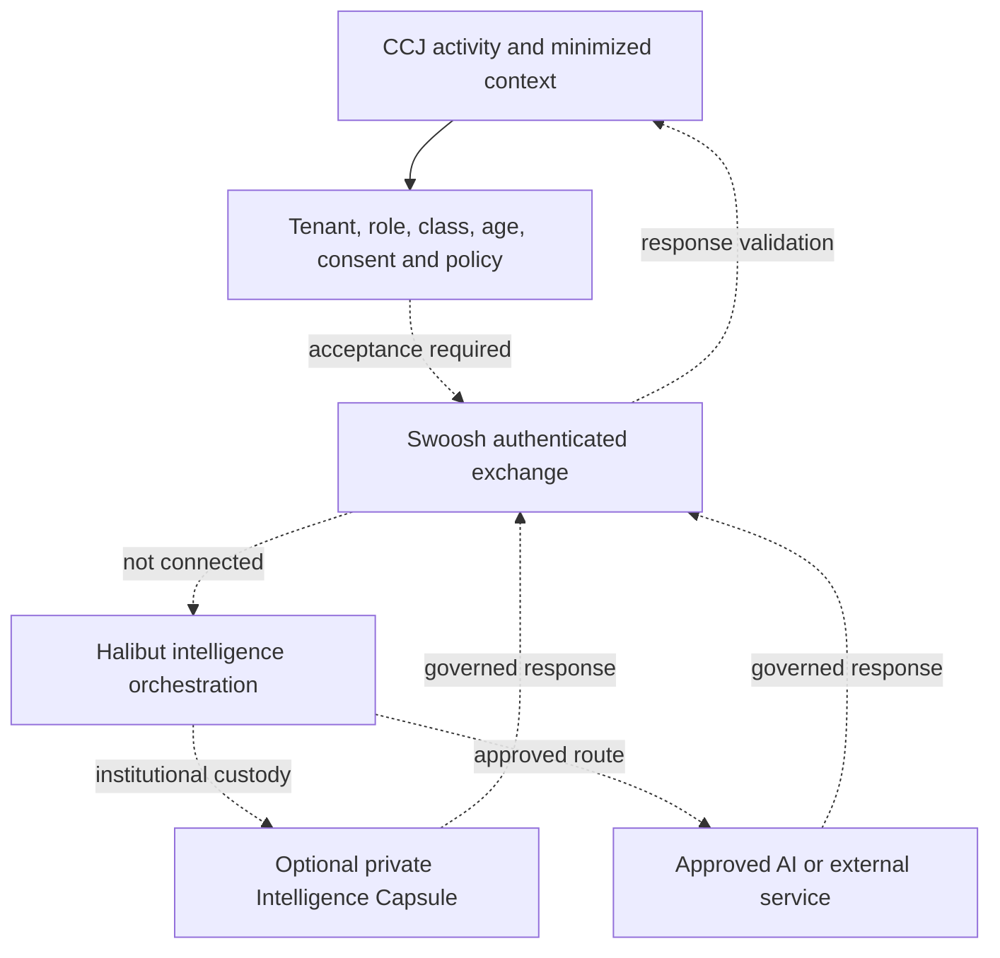
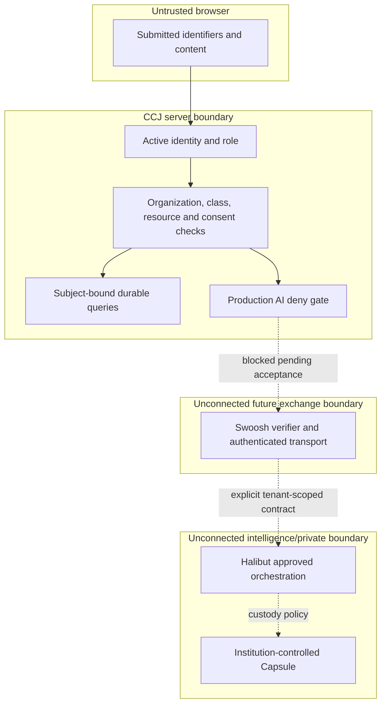

# CCJ remediation implementation checkpoint — 1 October 2026

**BLOCKED / INCOMPLETE. Documentation checkpoint only.**

The source changes described below were prepared and tested in the working checkout, not yet published to GitHub. This checkpoint branch contains documentation, not that modified application tree. It must not be merged as the completed remediation or used to claim production acceptance. CI on this documentation branch would test its base application, not the unavailable working tree.

## Baseline and interruption

- Existing Professor Vi branch: `feat/professor-vi-ai-study-report-cards`, commit `6d8f11425c1b4233cfcd231e912146700a11ce28`.
- Working checkout: `ccj-privacy-school`, local branch `feat/vietnam-school-privacy`.
- Local baseline: `71b7e32` materialized the exact Professor Vi tree; `38ce288` applied prior Phase A auth/environment/privacy corrections.
- Remediation source and additional tests were uncommitted when the execution service disconnected.
- Final execution failure: `environment_offline: Environment is not connected`. Repeated resume attempts failed.
- Final production-server HTTP checks were attempted but no result was obtained. Do not count them as passed.
- No migration or code rollout to production occurred. PR #50 must stay Draft.
- Recover and publish the working tree before further acceptance or merge. Do not recreate or replace the existing LMS architecture.

## Implemented in the unavailable working tree

1. Bilingual data notice, school processing terms, Professor Vi/Intelligence Instructor terms, printable consent form, login/recovery/capture notices and honest storage/localization choices.
2. Separate signed-in learner/verified representative optional approvals. Staff cannot impersonate family consent. Withdrawal/re-verification invalidates approvals; report recipients must match current consent.
3. Prepared migration `016_vietnam_privacy_governance.sql`: school agreements, verified representative authority, versioned approvals/events, rights requests, governance audit, adult synthetic pilot accounts and class pilot scopes. Not rehearsed or applied.
4. Independent school agreement review, school/operator contacts, actual countries/providers/retention disclosures, rights-case queue and authority revocation. These references/checkboxes do not establish legal compliance.
5. Closed learner registration and new profile provisioning while governance/onboarding switches are off. Existing admin access is preserved; new controlled staff bootstrap requires verified allowlisted identity.
6. Production AI execution is denied. Legacy direct-provider calls are restricted to verified adult synthetic preview/dev/test use; `governed_halibut` reports unconnected and cannot fall back to OpenAI.
7. Source retention bounded to 1–30 days; response `store:false`, foreground calls/timeouts, metadata-save cleanup, subject-bound deletion independent of AI activation. Deleting a provider file does not erase every derived CCJ record.
8. Bounded multipart streams, blank-template attestation and honest report-card fallback. Uploaded-file import cannot report success when deterministic fallback ignored the file. All generated study packs require teacher review.
9. Assessment read authorization tightened. Timed assessments cannot silently become untimed when disabled. Timed/outbox/quota pilots bind tenant, class, learner, verified adult synthetic participation and expiry.
10. Community submission/showcase/result gates require current relevant consent, including active team members. Learner export states its scope, missing systems and remaining case-based access categories.
11. CCJ-side proposed exchange contract validation: exact tenant/class/subject/resource/action, approved route, expiry, scalar field allowlist and restricted-content rejection. This is NOT the native Swoosh verifier/transport.
12. Protected blue-gray School Intelligence concept demo, synthetic data only, in-memory simulations/approvals, no real agents, connector writes or learner records. “Think Beyond — with Professor Vi” remains the learner environment.
13. Architecture document prepared at `docs/architecture/CCJ_IMPLEMENTED_ARCHITECTURE.md`, distinguishing actual local paths from unconnected target paths.

## Tests that actually completed

- TypeScript typecheck: passed.
- ESLint: passed with four existing image warnings; zero errors.
- Next.js 16.3.5 Turbopack production build: passed after the source changes.
- Existing suites passed: learning correctness, learning evidence, authorization, versioned activity contract, durable progress, idempotency, classroom revision, evidence/reporting, curriculum QA, device/PWA policy, operational closeout, adapter fixtures, platform-AI spend safety, Professor Vi/report-card policy.
- Latest governance regression: **44 passed, 0 failed**. Includes existing Phase A boundary tests, consent/policy scope denial, production provider blocking, closed signup, cross-subject rights/consent denial, deletion after withdrawal, disconnected pilot schema, deterministic fallback and bounded multipart behavior.
- A multipart test fixture originally triggered an Undici asynchronous producer failure after cancellation. It was corrected to a controlled stream that verifies cancellation; the final 44-test run passed.
- Final HTTP suite: **NO VERIFIED RESULT** after execution-service disconnection.
- No new authenticated two-tenant database journey, migration rehearsal, device drill, live LMS contract or restore drill is claimed.

## Actual prepared runtime path

This diagram describes the locally tested source changes, not the currently published/deployed code.

The required governed intelligence path remains a target dependency, not a deployed service:

Ordinary learning does not need every layer. Official progress, submissions, revisions, grades/evidence and feedback remain CCJ records, never transient model conversation state.

## Component/responsibility and readiness matrix

| Component | Responsibility | Status |
|---|---|---|
| CCJ | Existing learner/teacher/school UI, learning contracts, membership, assignments, feedback/revisions, assessment, progress/evidence | Existing system preserved; new hardening source not yet published |
| Think Beyond | Non-technical intelligent learning environment within CCJ | Prepared learner branding/UX; production AI blocked |
| Professor Vi | Learner-facing guidance and source-grounded study aids | Legacy adult synthetic sandbox foundation; not production-ready |
| Intelligence Instructor | Deterministic teaching progression, answer-release and school/teacher instructional rules | Existing protocol preserved; prompts are not a safety or mastery guarantee |
| Swoosh | Governed schemas, authenticated exchange, scoped trust/freshness/revocation | Proposed CCJ validator only; native verifier/transport not connected |
| Halibut OS | Context assembly, retrieval, agents/tools, model abstraction and policy-aware orchestration | No production runtime connected; concept demo only |
| Intelligence Capsule | Optional school-controlled knowledge, evidence/identity custody and private intelligence | Credential foundation reviewed; CCJ knowledge/storage/private-runtime connector absent |
| LMS/SIS/LTI | Their external systems of record, contract-scoped interoperability | Adapter foundations; LTI on separate feature branch; live sandbox acceptance pending |

## Data flow, classification and systems of record

| Data/path | Record/custody | Permitted processing or exchange | Readiness |
|---|---|---|---|
| Published curriculum and activity contract | CCJ versioned curriculum | Relevant approved activity excerpt; copyright limits apply | Existing learning path |
| Answers, progress and evidence | CCJ attempts/progress/learning capsules | Subject/class/tenant-scoped application queries; no automatic external credential | Existing source; authenticated acceptance pending |
| Assignment, feedback and revision | CCJ assignments/submissions/revisions/feedback | Active authorized classroom; staff-private feedback excluded from learner export | Existing source; real two-tenant journey pending |
| Assessment/rubric/report-card output | CCJ assessment records and school-approved templates/policies | AI drafts cannot become official grades autonomously | Timed path requires scoped adult pilot; migrated persistence unverified |
| Guardian report | CCJ reviewed/shareable evidence and student-visible feedback | Specific verified representative, active current dual consent; no private chat/reflection | Prepared gates; real accounts/schema pending |
| AI question/source/teaching state | CCJ disclosed turns/packs and temporary provider file in adult sandbox | Task-minimized context; production denied until governed runtime accepted | Not production-ready |
| Institution knowledge/local indexes | Optional Capsule target, per institution policy | Approved task-specific context; not an entire school DB or knowledge dump | Planned |
| Selected trust assertion | School evidence is authoritative; separate trust service may hold approved assertion | Pairwise reference, approved outcome/issuer/policy/commitment only; may still be personal data | No CCJ transport |
| Operational telemetry | Future Halibut operational service; demo uses fabricated records | Service outcome/request/latency metadata; never child reference, score, prompt or evidence commitment | Demo/proposed contract only |
| Restricted identities, health/confidential data, secrets | Institution-approved private custody; not these new public forms | Never portable trust or operational telemetry; proposed contract rejects restricted class | No external exchange |
| Rights/consent/authority proof | Prepared CCJ governance tables | Subject/verified representative access, tenant-bounded staff handling | Migration/persistence unverified |

Field validation is not semantic PII detection. Attestation does not replace document review. Hashes/pseudonyms are not automatically anonymous. Full account/processor/backup erasure and automatic retention enforcement remain unverified.

## Trust boundaries

A connected system grants no implicit cross-tenant access. Existing CCJ SQL authorization is not a claim that every table has RLS. Capsule RLS cannot protect CCJ tables. The signed-claim native verifier, authenticated sender/receiver, response schema, replay ledger and immutable exchange receipt service remain external dependencies.

## Deployment-mode matrix

| Mode | Benefit | Actual support / condition |
|---|---|---|
| ViTech managed cloud | Simpler application operation | CCJ cloud baseline; real regions, providers, backup/support and DPA must be confirmed; governed AI unavailable |
| Hybrid institution | Keep selected evidence/knowledge under school custody | Preference and contract design only; needs tested connector, custody migration, minimal exchange and restore |
| Intelligence Capsule/private intelligence | Institution-controlled knowledge/private context boundary | Optional target; credential repo is not a deployed CCJ on-prem knowledge engine |
| Institution-hosted/local intelligence | Institution-selected supported private models/services | Future; no local tutor/runtime bundled |

A preference does not provision or move records. Cloud Auth/server submissions remain cloud when a school selects device-local practice. Unsupported preferences cannot be approved as active deployments in the prepared review action. BYOK remains disconnected and fail-closed; encryption/rotation cannot be claimed from a policy checkbox.

## Degraded-mode matrix

| Failure | Prepared/current behavior | Missing acceptance |
|---|---|---|
| Swoosh/Halibut unavailable | Production AI denied; no direct provider fallback; normal CCJ learning independent | Connected transport, replay, timeout and signed-response tests |
| AI provider timeout | Bounded foreground sandbox call; controlled limitation | Real provider failure drill and retry/idempotency |
| Capsule unavailable | No connector active; dependent intelligence paused; unrelated learning independent | Actual custody recovery/RTO/RPO |
| Report builder AI unavailable | Deterministic draft remains; file migration cannot pretend it imported a file | Authenticated draft-save/activation journey |
| Optional consent withdrawn | New optional processing blocked; report recipient checked; own source deletion independent | Real concurrent/revocation DB journey |
| Provider deletion unavailable | Keep unresolved state/reference for retry/case; never claim complete erasure | Provider/backup execution proof |
| Integration unavailable | Retry/dead-letter foundations; real non-health transports blocked | Recorded sandbox fixtures/reconciliation and per-tenant acceptance |
| Device eviction | Local work can be lost; acknowledged server records remain durable | Physical iOS eviction/reconnect/replay |
| DB/Auth unavailable | Authenticated writes require their backend; supported public/static learning remains independent | Real restore drill and measured loss/recovery |

## Vietnam notice/legal basis

Prepared bilingual terms use Vietnam Law 91/2025/QH15 and Decree 356/2025/NĐ-CP, effective 1 January 2026:
- https://chinhphu.vn/?classid=1&docid=214590&pageid=27160&typegroupid=3
- https://chinhphu.vn/?classid=0&docid=216387&pageid=27160

The product conservatively requires separate junior learner assent and verified representative approval for optional features. This is not a claim that every activity has the same statutory child-consent rule. Login/silence/preselected boxes do not grant optional consent. Named contracting parties, operator/school contacts, actual processing countries, processors, retention, impact/transfer duties and rights/incident procedures still require real institutional evidence. Code/document generation is not legal or operational sign-off.

## Restore point and outstanding production gates

Snapshot created successfully:
- `snap-orange-meadow-b3du3v0y`
- source branch `br-shiny-meadow-b3ibu54h`, project `royal-queen-79814128`
- created `2026-09-30T20:31:42Z`; expires `2026-10-08T00:00:00Z`
- No restore was executed. RTO/RPO and usable restore procedure remain unmeasured.

Fresh child branch creation returned HTTP 422, `branches limit exceeded`. No branch was deleted.

Every role below needs a named human owner before the actual gate begins; names remain unassigned.

| Item | Accountable owner role | Exit criterion | Rollback/containment |
|---|---|---|---|
| Recover/publish working source | ViTech engineering lead | Retrieve exact tested tree, diff and publish reviewable implementation commits | Keep this checkpoint Draft; do not substitute untested reconstructed code |
| Learning/evidence stages 1–8 | Learning + engineering lead | Tests plus real explain → create → feedback → revision records; correct evidence/version semantics | Disable affected release; retain durable source records |
| Authz/guardian/privacy acceptance | Security/privacy reviewer | Real learner/representative/teacher/admin cross-role and two-tenant negative journeys | Disable optional sharing/reporting; preserve withdrawal/case access |
| Current admin + second admin | Identity owner | Genuine email verification, named second controlled account, both login/recovery and break-glass tested | Leave verified-admin tightening off; preserve current controlled access |
| Migrations 014/015/016 | Database/release owner | Fresh production-data child rehearsal, collision check, old/new code compatibility and captured restore evidence | No production SQL while blocked; retain additive schema/proof if rollback required |
| Preview/production separation | Platform owner | Verify actual secret scopes and Auth/database branches; no production reachability from preview | Disable affected preview; remove/revoke wrong-scope credentials |
| Vietnam children's-data gate | ViTech privacy + school legal owner | Executed DPA, contacts/countries/retention/processor/impact/transfer evidence and independent sign-off | Keep real learner onboarding and optional AI/sharing off |
| Swoosh/Halibut/Capsule | Integration/security owners | Official native verifier/bridge, service contracts, scoped context, receipt/replay/response validation, custody and key tests | Fail closed; no direct AI fallback or raw payload exchange |
| Live integrations/LTI | Integration + institution IT owner | Recorded sandbox contracts; launch/deep-link/NRPS/AGS, dry-run diffs, per-tenant idempotent acceptance | Disable connector execution and revoke its scoped credential |
| iOS/offline/accessibility/audio | Device QA owner | Physical device, eviction/reconnect/replay/idempotency and accessibility journey | Keep outbox off; retain browser-local audio/manual alternatives |
| Restore/rollback drill | Database + release owner | Measured recovery time and loss, validated restore and code compatibility | Retain restore point, restore under approved procedure; do not claim unmeasured success |
| Curriculum conversion | Curriculum QA owner | Honest content labels, authoritative contracts/answers and independent QA gates | Unpublish failed content version; keep previous approved version |
| Internal pilot → real students | Release + school owner | One scoped adult synthetic class first, then all children's-data gates signed | Default-off risky features; do not convert PR #50 from Draft prematurely |

**Production readiness: NOT approved for real children's data.** Source publication and final verification are blocked by the offline execution environment; database rehearsal, identities, real accounts/devices and external service acceptance remain outstanding.
